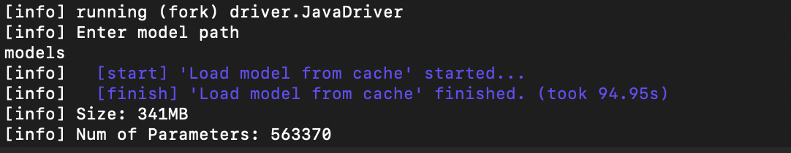
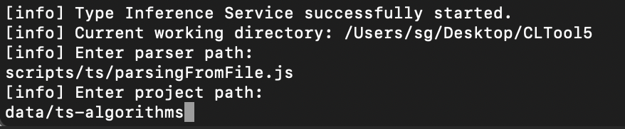
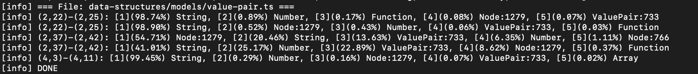

# LNTool

## Preparing build environment
- Install [sbt](https://www.scala-sbt.org/download.html) to manage dependecies 
  - You may need to update path to include sbt
- If using provided test case, download model weights [here](https://drive.google.com/file/d/1NvEVQ4-5tC3Nc-Mzpu3vYeyEcaM_zEgV/view?usp=sharing)
  - Unzip and place 'models' file under project root
- Compile parsingFromFile.ts with tsc

## Running tool
- Download and unzip this repo
- In a terminal or command prompt window, cd to project root
- run `sbt "runMain driver.JavaDriver"`
- When prompted, enter path to model file
  - File must be in same format as example provided on Lambdanet github
  - If using provided test case, enter `models`
  - Program will output model size and number of parameters

- When prompted, enter path to parser
  - If using provided parser, enter `scripts/ts/parsingFromFile.js`

- When prompted, enter path to project directory
  - If using provided project, enter `data/ts-algorithms`
- Program will output top five predictions for each case

## Notes
- Developed in MacOS environment, tested build/install/execution on MacOS and Windows environments
